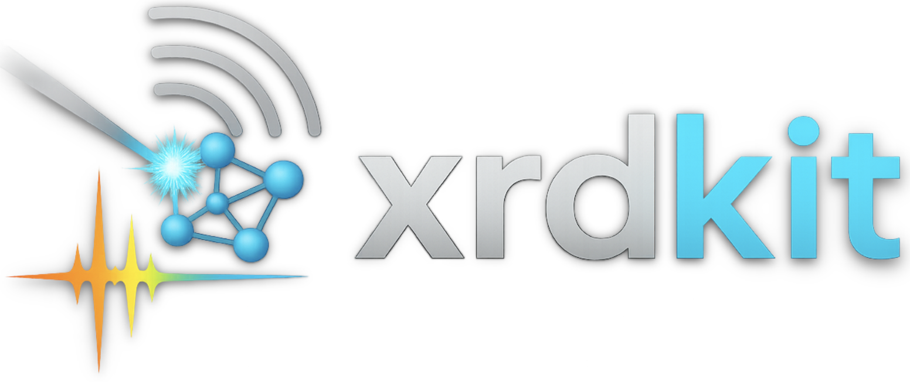

<p align="center">
  
</p>

# xrdkit

Interactive XRD reference patterns from five sources, mixed in a single figure:

- **ICDD / JCPDS reference cards** — eight built-in PEMWE / OER phases
- **Local structure files** — CIF, POSCAR / CONTCAR, `.vasp`, `.json`, `.xyz`, `.xsf`
- **Crystallography Open Database (COD)** — search by formula, no API key
- **Materials Project** — search by formula, free API key
- **Measured or computed diffractograms** — `.xy`, `.csv`, `.txt`, `.dat`, `.tsv`, PANalytical `.xrdml`

A browser GUI (Streamlit) for interactive use, a command-line entry point for batch rendering, and a small Python API. Vector PDF and animated GIF export.

## Try it in the browser,

*👉 Live app: https://xrdkit.streamlit.app**

  [](https://xrdkit.streamlit.app)

  Open the link and use XRDKit directly in your browser; nothing to install. Tick
  reference phases, upload a measured pattern, and export publication-quality
  figures. Deployment notes (Streamlit Cloud / Hugging Face / self-hosted) are in
  [`DEPLOY.md`](DEPLOY.md).

## Install

Clone and install in a fresh environment:

```bash
git clone https://github.com/NabKh/XRDKit.git
cd XRDKit
pip install -e .            # installs xrdkit + dependencies
```

Or without editable install:

```bash
pip install -r requirements.txt
```

Python 3.10+ recommended.

## Launch the GUI

```bash
python launch.py
```

Browser tab opens at `http://localhost:8501`. Pick ICDD cards on the left, upload or search on the right, the plot updates live, click Download PDF / Download GIF.

## Built-in ICDD reference cards

| Phase | Card | Space group |
|---|---|---|
| Pt | PDF 04-0802 | Fm-3m |
| Ir | PDF 06-0598 | Fm-3m |
| α-Ti | PDF 44-1294 | P6₃/mmc |
| TiO₂ rutile | PDF 21-1276 | P4₂/mnm |
| TiO₂ anatase | PDF 21-1272 | I4₁/amd |
| IrO₂ rutile | PDF 15-870 | P4₂/mnm |
| RuO₂ rutile | PDF 40-1290 | P4₂/mnm |
| TiO₂ brookite (proxy) | PDF 29-1360 | Pbca (proxy) |

Peak positions are computed from lattice parameters via Bragg's law (`xrdkit/core.py`); intensities are the kinematic random-powder values from the cited card. Wavelength is switchable.

## Features

| Feature | Where |
|---|---|
| Wavelength dropdown (Cu / Co / Mo / Cr Kα, synchrotron 1.0 Å) | sidebar |
| Kα1 / Kα2 doublet rendering (Δ2θ from λ ratio, 2:1 intensity) | sidebar |
| Crystallite-size slider → Scherrer FWHM | sidebar |
| pseudo-Voigt η mixing | sidebar |
| 2θ range | sidebar |
| Linear background slope | sidebar |
| (h k l) labels on peaks with intensity threshold | sidebar |
| Stacked-offset vs single-baseline overlay | sidebar |
| Sticks (Dirac) plus smooth profile, independently toggleable | sidebar |
| Peak list table — 2θ, d-spacing, intensity, hkl, source | beneath plot, CSV download |
| Per-phase structural info (lattice, space group, source) | beside plot |
| **Observed − simulated difference** (SNIP background, zero-shift align, NNLS phase scaling, residual + R_p / overlap) | beneath plot |
| PDF export (vector, editable text) | beside plot |
| GIF export (cumulative reveal) | beside plot |

### Observed − simulated difference

The Rietveld-style observed / calculated / difference figure: the selected
reference phases are background-subtracted (SNIP), zero-shift aligned, and scaled
to a measured pattern by **non-negative least squares**, then the residual is
drawn below with colour-matched Bragg tick rows. Reported `overlap` (cosine) and
`R_p` are pattern-similarity scores for kinematic reference overlay — **not** a
Rietveld goodness-of-fit. Three worked examples (Pt, rutile TiO₂, nanocrystalline
IrO₂) with figures and data are in
[`examples/observed_simulated_difference/`](examples/observed_simulated_difference/).

```python
from xrdkit import builtin_phases, load_measured, compute_difference, make_difference_plot

lib = builtin_phases()
meas = load_measured("sample.xy")
data = compute_difference(meas, [lib["IrO₂ rutile"]], wavelength_A=1.54184,
                          crystallite_nm=3.0, tt_range=(20, 90))
fig, _ = make_difference_plot(data)        # overlap, R_p, scales in `data`
```

## Command line

```bash
# all built-in phases at Cu Kα, 30 nm crystallites, 20–90°
xrdkit --out .

# only Pt + IrO2, with (hkl) labels and Kα1/Kα2 doublet
xrdkit --phase Pt --phase "IrO₂ rutile" --show-hkl --kalpha12

# mix sources: a built-in, a CIF, an MP entry, a measured pattern
xrdkit --phase Pt --cif my.cif --mp mp-126 --measured sample.xy

# Co Kα over a wider window
xrdkit --wavelength "Co Kα" --tt-min 10 --tt-max 110
```

Outputs `xrdkit_stacked.pdf`, `xrdkit_overlay.pdf`, `xrdkit.gif` in `--out`.

## Python API

```python
from xrdkit import builtin_phases, from_cod_id, make_figure, save_pdf, peaks_table

lib = builtin_phases()
phases = [lib["Pt"], lib["IrO₂ rutile"]]
phases.append(from_cod_id("9005887"))   # Co3O4 spinel from COD

fig, ax = make_figure(phases, wavelength_A=1.54184,
                     crystallite_nm=30, tt_range=(20, 90),
                     show_hkl_labels=True, kalpha12=True)
save_pdf("pattern.pdf", phases=phases, wavelength_A=1.54184)

print(peaks_table(phases, 1.54184, (20, 90))[:3])
# [{'Phase': 'Pt', '2θ (°)': 39.764, 'd (Å)': 2.2657, 'I (%)': 100.0, 'hkl': '1 1 1', ...}, …]
```

## Scope and honest limits

xrdkit produces **kinematic random-powder reference patterns** for the sake of phase identification, peak-position diagnostics, figure composition, and observed−simulated difference inspection. The difference tool background-subtracts (SNIP), zero-shift aligns, and least-squares scales the reference to a measurement, reporting `R_p` / cosine overlap as *similarity* scores. It does **not** do:

- a Rietveld structural refinement or true goodness-of-fit χ² (use GSAS-II / FullProf / TOPAS)
- quantitative phase analysis (the NNLS scales are a relative-abundance proxy, not weight fractions)
- preferred-orientation modelling
- texture / pole-figure analysis
- size / strain separation (Williamson-Hall)

DFT-relaxed Materials Project lattices can be 1–2 % larger than experimental, shifting peaks 0.1–0.3°. Prefer COD or ICDD-card values when peak positions matter. Amorphous and disordered phases (commercial Heraeus IrO₂, anodised TiO₂) are not in any structural database — no synthetic reference can reproduce them without a structural model.

See [`docs/methodology.md`](docs/methodology.md) for the full methodology note (Bragg's law, structure factor, Scherrer, pseudo-Voigt, what an experimentalist must provide).

## Repository layout

```
xrdkit/
├── pyproject.toml              installable Python package
├── README.md
├── DEPLOY.md                   host as a no-install web app (Streamlit Cloud / HF / self)
├── ROADMAP.md                  prioritised scientific feature menu
├── LICENSE                     MIT
├── CITATION.cff
├── requirements.txt
├── launch.py                   one-command GUI launcher
├── app.py                      Streamlit entry point
├── .streamlit/config.toml      hosted-app theme
├── xrdkit/
│   ├── __init__.py             public API
│   ├── core.py                 lattice / Bragg / pseudo-Voigt / Scherrer
│   ├── db.py                   Phase abstraction, CIF / COD / MP loaders
│   ├── plot.py                 figure rendering, GIF, peak table, difference tool
│   └── cli.py                  command-line entry
├── examples/
│   └── observed_simulated_difference/   3 worked examples (data + script + figures)
├── tests/
│   └── test_smoke.py
└── docs/
    └── methodology.md
```

## Tests

```bash
pip install -e .[dev]
pytest -q
```

## Comparison to existing tools

xrdkit is a **figure composer**, not a refinement package.

| Tool | What it does | xrdkit overlap |
|---|---|---|
| HighScore / Match! (commercial) | Phase ID + Rietveld + database | xrdkit covers the phase-ID and reference-overlay parts, free, open-source |
| GSAS-II / FullProf / TOPAS | Full Rietveld refinement | xrdkit does not refine — feeds reference patterns for inspection only |
| PyXRD | Clay-mineral profile fitting | unrelated scope |
| pymatgen's XRDCalculator | Computes patterns from a Structure | xrdkit *uses* this and wraps it in a multi-source GUI |

## Author

**Nabil Khossossi**, PhD
Researcher | AI-Driven Materials Discovery | Computational Chemistry

## License

MIT — see `LICENSE`.

## Citation

If xrdkit helps with a publication, please cite this repository — see `CITATION.cff` for BibTeX / format-of-choice.
